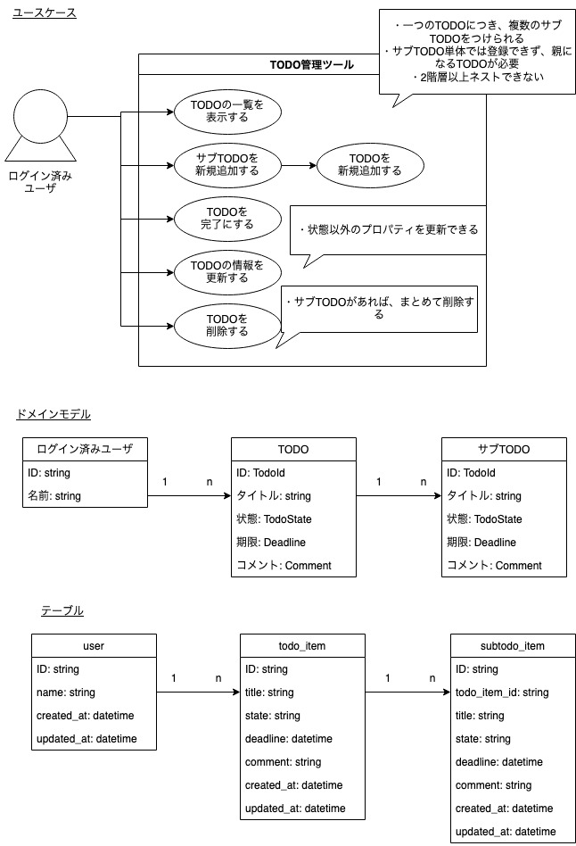

# todo_on_rails

簡素なTODOアプリバックエンド on rails。

# 機能要件
## 機能概要
TODOアプリケーションの、バックエンド機能を提供するREST API。やることを示す *TODO* を中心に、
ネストしたTODOオブジェクトである *サブTODO* の登録も可能。 サブTODOは親のTODOに依存した構造になっており、ステータス遷移や登録において制約を受ける。

## ユースケース、ドメインモデル


※そこそこ多機能なので、順次機能を追加していく

# システム要件
* Ruby version
```bash
$ ruby -v
ruby 2.6.10p210 (2022-04-12 revision 67958) [x86_64-darwin20]
```

```bash
$ rails -v
Rails 6.1.7
```

# アプリケーションブループリント
デフォルトのapp配下ディレクトリに、ドメインオブジェクト（POROの集まり）を拡張することでドメインオブジェクトを表現、扱えるようにする。

ユースケース以下ドメインオブジェクトはドメイン層で完結するような構成にする。
そのため、コントローラはJSONシリアライズ・デシリアライズのみを司るプレゼンテーション層、Modelにはロジックをかかずデータオブジェクト・薄いORMとして扱う。

# 環境構築
* System dependencies

* Configuration
For rails console, 

Create a user
```ruby
User.create!(id: 1, name: 'Main user')
```

Create a todo associated with user 1
```ruby
TodoItem.create!(id: 1, title: 'create a mtg handout', state: '1', deadline: 7.days.after, user_id: 1)
```

* Database creation

* Database initialization

* How to run the test suite

* Services (job queues, cache servers, search engines, etc.)

* Deployment instructions

